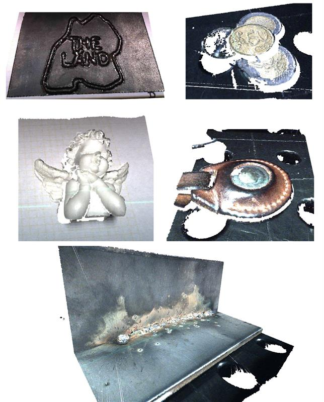

# Sensor Data Fusion for Welding Robots
## Repository Purpose
This repository serves as a public dataset showcasing the results of sensor data fusion developed during the research for the master's thesis titled: *"Fusion of Image and Depth Data to Optimize Perception in Automated Welding Applications"*. The repository provides access to the fused point clouds, along with the input data that includes RGB images from a line-scan camera and 3D point cloud data from a laser triangulation sensor.

## Dataset Contents
- **Input Data**:   
    - RGB images captured by a line-scan camera.
    - 3D point cloud data from a laser triangulation sensor.
- **Fusion Results**: 
  - Fused point clouds

  

## Disclaimer
This repository does not include code from the implementation phase of the thesis.

For inquiries or further information, please contact:  

industrieanfragen@ipa.fraunhofer.de
